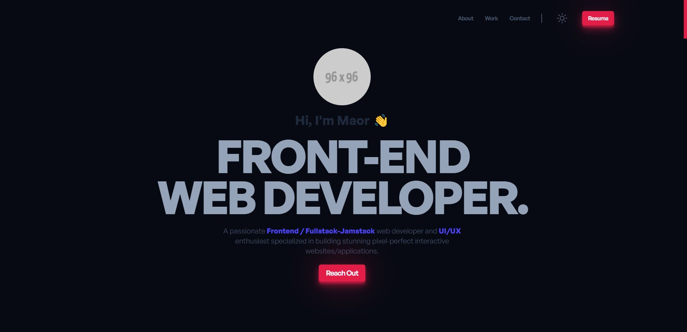

# simpleportfolio

A minimal portfolio template for Developers!
[Video]

# Features
⚡️ Modern UI Design + Reveal Animations <br>
⚡️ One Page Layout<br>
⚡️ Fully Responsive<br>
⚡️ Valid HTML5 & CSS3<br>
⚡️ Optimized with Vite<br>
⚡️ Well organized documentation<br>

To view the demo: <a href="#"> click here </a>


# Why do you need a portfolio? ☝️
Professional way to showcase your work
Increases your visibility and online presence
Shows you’re more than just a resume

# Getting Started 🚀
These instructions will get you a copy of the project up and running on your local machine for development and testing purposes. See deployment for notes on how to deploy the project on a live system.

# How To Use 🔧
```bash
# Clone the repository
$ git clone https://github.com/cobidev/simplefolio

# Move into the repository
$ cd simplefolio
```
After that, you can install the dependencies using NPM.

Using NPM: Simply run the below commands.

```bash
# Install dependencies
$ npm install

# Start the development server
$ npm run dev
```
Once your server has started, go to this url ` http://localhost:5173/` to see the portfolio locally. It should look like the below screenshot.


<h2 align="center">
  
</h2>


---

## Template Instructions:

### Step 1 - STRUCTURE

Go to `/src/index.html` and put your information, there are 5 sections:
### (1) Hero Section

- On `.hero-title`, put your custom portfolio title.
- On `.hero-cta`, put your custom button label.

```html
<!-- **** Hero Section **** -->
<section id="hero" class="jumbotron">
  <div class="container">
    <h1 class="hero-title load-hidden">
      Hi, my name is <span class="text-color-main">Your Name</span>
      <br />
      I'm the Unknown Developer.
    </h1>
    <p class="hero-cta load-hidden">
      <a rel="noreferrer" class="cta-btn cta-btn--hero" href="#about">
        Know more
      </a>
    </p>
  </div>
</section>
<!-- /END Hero Section -->
```


